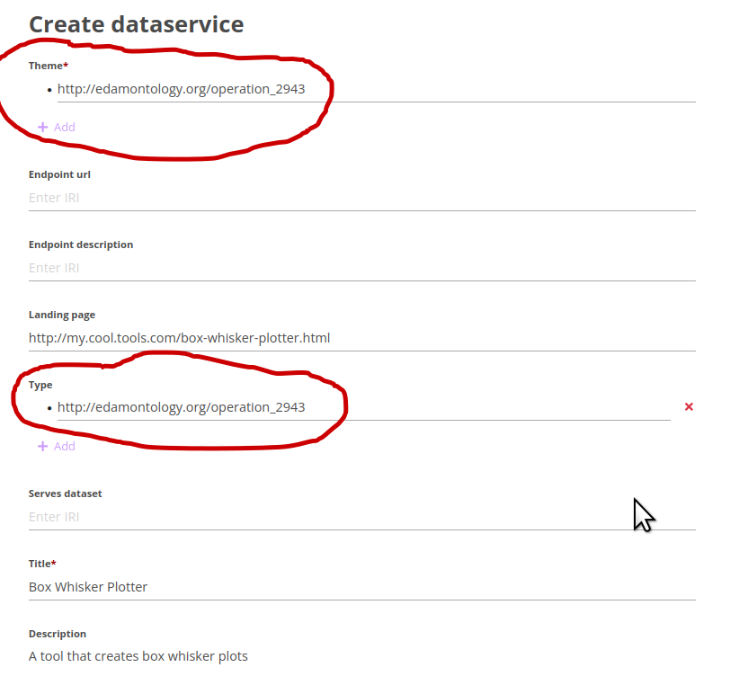

# FDP-Configuration
A record of the process for configuring the Reference Implementation of the FAIR Data Point (the one that is included in FAIR-in-a-box) for use on the EJP-RD Virtual Platform

## Setting the default license

NOTE: The EJP-RD "non-license" can be set as the default license:  https://w3id.org/ejp-rd/resources/licenses/v1.0 and various other defaults can be configured to more useful values.

To do this: 

* Go to your FiaB folder.  
* Go into the ./fdp subfolder
* edit the "application-xxxx.yml" file (xxx is the prefix name you used when you ran the FiaB installer)
* add the following lines to the bottom of that file:
  
```
metadataProperties:
    language: http://id.loc.gov/vocabulary/iso639-1/en
    license: https://w3id.org/ejp-rd/resources/licenses/v1.0
    accessRightsDescription: Contact the owner/curator of this resource to determine your access rights

ping:
    interval: PT120H
```

* now shut-down and restart your FiaB using docker-compose


# Navigating the FDP configuration menu

* first, you need to be logged-in (default user:  albert.einstein@example.com, pass: password)
* The drop-down menu (top right) looks like this:


The two menu entries we are interested in are:
* Resources Definitions:  What kinds of things can be in your FDP?  The defaults are:
  


* Metadata schemas:  What is the "shape" of the things, and what web form elements should be used to capture those?  The defaults are:


## Editing the Schemas

We need to edit two schemas - Resource and Data Service - to bring them into compliance with the Virtual Platform.  To begin editing a schema, click on it.  

Start with **Resource**


The part we need to change is at the bottom - the SHACL definitions of the shape and constraints.

The correct SHACL for a Resource is found here:  [resource.shacl](./shacl/resource.shacl)

Copy/paste that into the Web form, and then **Save and Release**.  You will be asked to assign a version number.  This is arbitrary, but the version has to be higher than the previous version (1.0.0).


Now edit **Data Service**


Many portions of that need to be edited.  Follow my suggestions in teh image above.  

The SHACL also needs to be edited.  the correct SHACL for a Data Service is found here: [data-service.shacl](./shacl/data-service.shacl)

Save and give it a version.


## Create a new Resource Definition for Patient Registry

Back in the main menu, select "Resource Definitions", then click the "Create Resource Definition" button:


Follow the guidelines in the image below to fill the fields, then save:


## Create a new Resource Definition for Data Service

Click the "Create Resource Definition" button again.

Follow the guidelines in the image below to fill the fields, then save:


**NOTE:**  In EJP there are two "kinds" of Data Service - services that serve a dataset, and services that do algorithmic operations or plotting, but do not access a registry or biobank.  

**THE NORMS ARE:**
For services that serve a dataset, they:
* must be a "child of" a distribution of dataset
* must have an endpointURL (the URL of the interface)
* must have an endpointDescription (the URL leading to e.g. a Swagger/openAPI document)

For services that execute algorithmic operations, they:
* must be a "child of" "Catalog"
* must have a landingPage (the URL of the homepage, where you can do the operation)

**THESE NORMS ARE NOT ENFORCED BY THE FDP!!  So... just be good citizens!**


## Connecting things together

Go back to the Resource Definitions (main menu)

We need to **make Patient Registry a child of Catalog**

This is what "Catalog" looks like at the beginning:


The red arrow is where we create a new child - in this case, we are going to make Patient Registry a child of Catalog.  Note that the property that the Metadata team decided to use is "hasPart"


While we're here, we also need to **make Data Service a child of Catalog**.  Same idea, in this case, DCAT has defined what the property must be:  "dcat:service".


Save!


We need to **make Data Service a child of Distribution**

Same process as above.  In this case, strangely, DCAT has a different predicate:  "dcat:accessService"


Save!

Done!!

## Create a new record - a Data Service that does visualization (Box-whisker plot)

Now we will create a Data Service to make sure everything is working as-expected.  Data Service is a child of catalog, so we need to first create a Catalog.  (go ahead and do this now!).  Once created, that catalog has three kinds of "children", indicated by the tabs:  Datasets, Data Services, and Patient Registries.

Click on the "Data Services" tab, then "+Create"

I'm creating a hypothetical Box-Whisker plot tool.  The _**"theme"**_ is the concept of a box-whisker plot (from EDAM:  **operation_2943**).  **Note that, because this tool is NOT serving a dataset, I am only require to include a landing page.  (endpointURL and endpointDescription are allowed to be empty)**



Further down the page there are additional fields that I would like to fill-out.  For example, I am going to declare that this service does not utilize personal information (in the GDPR sense).  The allowed values are "true" and "false"  (lower case!).  I am not sure if this is enforced or not

I also want to tell the VP that the service exists, so I need to make it **VPDiscoverable**.  the allowed values are:
* http://purl.org/ejp-rd/vocabulary/VPDiscoverable
* http://purl.org/ejp-rd/vocabulary/VPQueryable


Save!

You will see that it is in draft form.  The button on the right leads to the tool.  It is advertising itself as being VP Discoverable.  Now all you need to do is click "Publish" (also on the Catalog)...


### DONE DONE DONE!

# Additional Configuration

On a production server, you need to activate the "ping" to register yourself with the virtual platform.

This has two steps:

*  Go back to the "./fdp/application-xxx.yml" file and edit the clientURL to be your permanent identifier.

e.g.     clientUrl: https://w3id.org/duchenne-fdp

This is the URL that is sent during the "ping" to the VP Index.  IT CANNOT BE LOCALHOST!

* Add the VP Index as one of the "ping" locations (see diagram below)


Finally, that last field should now read "PT120H", because this is the ping/interval that we set in the very beginning (in the ./fdp/application.yml file).  This is set to ping the VP Index every 5 days.  If your FDP does not ping at least every week, the Index will consider it "inactive" and it will not appear in the main index... so... 5 days should be good!


